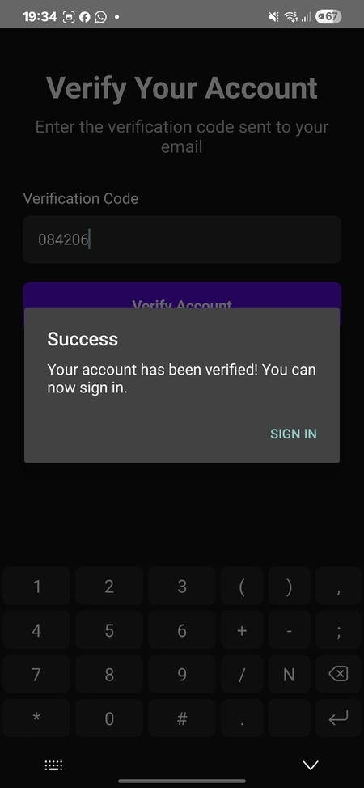
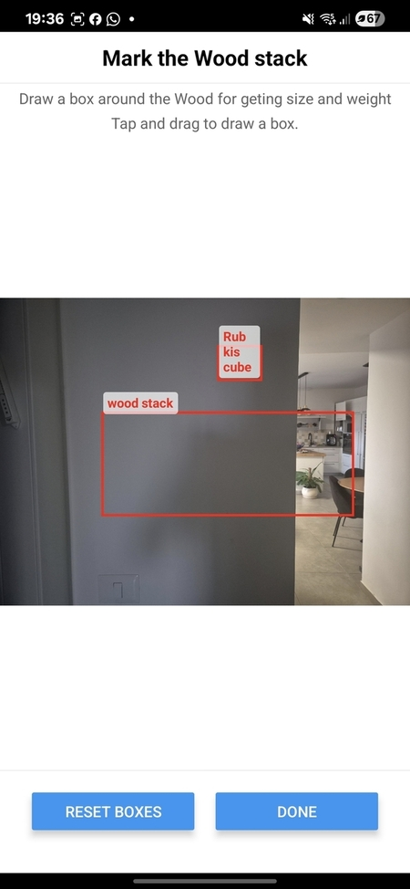
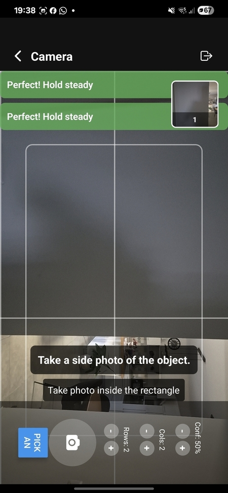
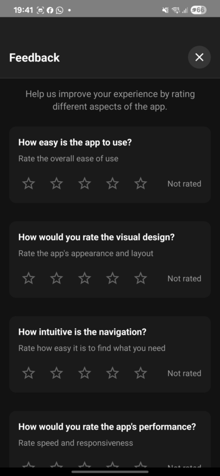

# הנחיות למשתמש

תלחצו על Sign Up בתחתית העמוד בצבע סגול

תמלאו את הפרטים בעמוד נקודות למילוי:
* האימייל חייב להיות אימייל אמיתי
* הסיסמה חייבת להיות סיסמה חזקה כלומר אם אותיות גדולות וקטנות באנגלית מספרים וסימן מיוחד
* המספר טלפון לא חייב מספר אמיתי רק שיתחיל ב+ וקוד מדינה כל שהוא ואז 9 ספרות מי שרוצה למלא לטלפון ישראלי זה +972 ואז מספר הטלפון ללא 0 בהתחלה וללא רווח
* שם משפחה ניתן למלא גם בעברית
* הסיסמה צריך להיות באנגלית אותיות גדולות וקטנות אם מספרים וסימן מיוחד ובאורך 8

בסוף תלחצו על כפתור הSign Up בתחתית

אתם תקבלו קוד לאימייל שהכנסתם תעתיקו את הקוד ותזינו אותו ואז תלחצו על Verify Account

תלחצו על כפתור SIGN IN הירוק

תמלאות את השם משתמש והסיסמה שהזנתם ברישום ותלחצו על Sign In

תלחצו על כפתור הCamera בראש העמוד

תלחצו על MANUAL FLOW

תלחצו על הכפתור הכחול GRANT PERMISSION

תאפשרו הרשאות למצלמה בזמן שימוש באפליקציה While using the app

סובבו את הטלפון שהיה לאורך ותחזיקו אותו בזווית ישרה

ההודאה האדומה הראשונה תהפוך לירוקה כאשר אתם מחזיקים את האלפון ישר 

וההודעה השניה האדומה כאשר אתם מחזיקים את הטלפון לאורך

ככה זה אמור להראות תלחצו על הכפתור של לקיחת התמונה בתחתית אם האייקון של המצלמה (לא משנה תמונה של מה אתם לוקחים)

פו תסמנו על גבי התמונה 2 מלבנים על ידי לחיצה על התמונה וגרירת העצבע

תלחצו על הכפתור Done

תמתינו עד שהתעינה תיסתיים ובסיום הוא אמור לכחת אתכם לעמוד של המצלמה אם לא תלחצו על Done עוד פעם וזה אמור להסתדר

תקחו עוד תמונה עוד פעם לפי ההנחיות של להחזיק את הטלפון לאורך ולא בזווית

תסמנו עוד פעם 2 קוביות ותלחצו על Done הסימון הוא על ידי לחיצה על התמונה וגרירת העצבע

לאחר ההמתנה הוא אמור לקחת אתכם לעמוד הבא במקום למצלמה תגללו למטה ותלחצו על Continue to Results

תגללו למטה ותלחצו על save

תלחצו על החץ אחורה שבראש העמוד מצד שמאל עד שתגיעו למסך הבית

אם התוצאה לא מופיע פו תלחצו על האייקון שליד הסימן של ההודעה בראש העמוד בשביל להתנתק ותחברו מחדש

במידה והתוצאה קיימת תלחצו על הסימן של ההודעה בראש העמוד

תנו לנו פידבק על האפליקציה